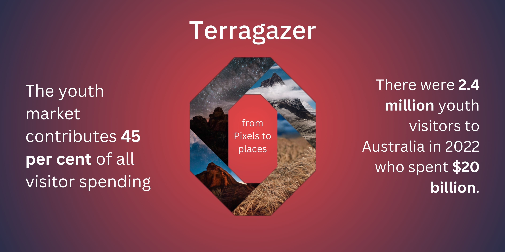

# Urban Threshold - Terragazer

[Our Mockup](https://www.figma.com/proto/Na3PsvWilKynPTZtnF9tG8/Mock?type=design&node-id=23-59&t=GM6bWVwFR1FYCdjk-1&scaling=min-zoom&page-id=0%3A1&starting-point-node-id=23%3A59&mode=design) | [Hackerspace Project](https://hackerspace.govhack.org/projects/terragazer) | [YouTube Video](https://youtu.be/zfWL4CPNKO4)

#### Tourism in Australia accounts for over $35b of GDP in FY22, with youth tourism making up a significant portion of that figure (according to Tourism Australia). Youth tourism is also very important for the transfer of culture between generations, something that cannot be measured by numbers. We aim to increase the availability of youth tourism through our app Terragazer.

## Why is our app different? 

**Gamification:** The app uses the principle of gamification to engage modern youth. Users post short videos of tourist attractions and others try to guess their location. Points are awarded based on the accuracy of the guesses. 

**Point Redemption System:** Points earned in the app can be redeemed at local tourist attractions, such as restaurants, rides, and tours. This creates a micro-economy powered by tourism within the area and has the potential to replace traditional travel vouchers with a digital alternative.

**Travel Planning:** The app integrates travel planning features powered by machine learning, making it easier for users to book short holidays. The tool integrates with common travel agent tools, allowing the booking process to be fully automated. 

**Trip Summaries:** The app can summarize trips into short videos that incorporate key moments and challenges posted by the user while on the trip. These videos can be shared on the platform to gain additional points and promote tourist attractions even after the user has left the area. 

## How does this benefit communities?

Terragazer has the potential to bring several benefits to communities and the tourism industry in Australia:

1. **Engagement of Youth and Cultural Exchange**: Terragazer encourages young people to engage with tourist attractions in a fun and interactive way. By incorporating short videos and a game-like experience, we are able to capture the attention of the younger generation, encouraging them to explore and learn about different attractions. The process of sharing videos and guessing locations also facilitates cultural exchange by allowing users to share their travel experiences and unique perspectives.

2. **Economic Boost for Local Businesses**: Our app's point-based redemption system can drive traffic to local businesses such as restaurants, tours, and attractions. By offering rewards that users can redeem at these establishments, we create a symbiotic relationship where tourism benefits local businesses and vice versa. This can contribute to the growth of the local economy and support job creation.

3. **Environmental Benefits**: By providing a digital alternative to traditional paper vouchers and pamphlets, our app can help reduce the carbon emissions and environmental impact associated with printing and distributing physical materials. This aligns well with sustainable tourism practices, which are becoming increasingly important to travelers and communities alike.

4. **Streamlined Travel Planning**: The integration of machine learning-powered travel planning features simplifies the process of booking short holidays. This convenience can encourage more people to travel, as the barriers to entry are lowered. The automation of the booking process also benefits the overall travel industry by reducing administrative load and allowing travel agents to focus on other aspects of customer service.

5. **Promotion of Tourist Attractions**: The feature that summarizes trips into short videos not only allows users to reminisce about their experiences but also serves as a promotional tool for tourist attractions. Sharing these videos on the platform keeps the momentum going even after users have left the area, potentially inspiring others to visit the attractions showcased.

6. **Data-Driven Insights**: As users engage with our app, we will gather valuable data on user preferences, popular attractions, and travel patterns that can be open sourced and shared with local businesses and tourism boards to enhance their offerings and make informed decisions about marketing strategies and infrastructure development.
